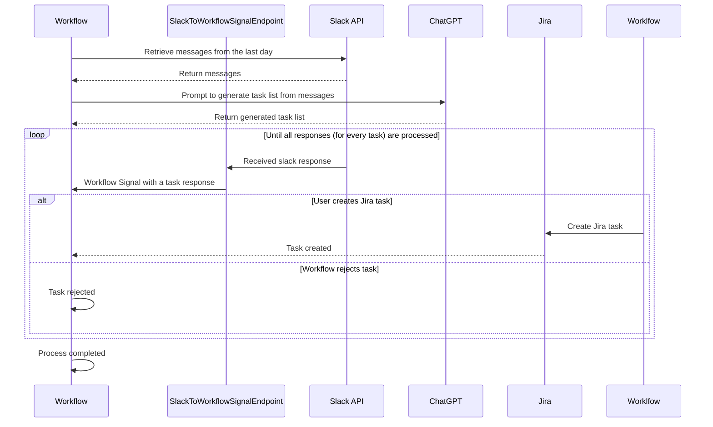

# Automating Task Extraction from Slack Messages Using ChatGPT and Jira Integration

## Overview

This automation aims to retrieve Slack messages from the past day, extract actionable tasks using ChatGPT, and allow the user to either create Jira tasks or reject them directly from Slack. The process continues until all tasks receive a response.

## Workflow Steps

1. **Retrieve Slack Messages**
    - The system fetches all messages from the last 24 hours for a specific user via the Slack API.

2. **Generate Task List with ChatGPT**
    - The retrieved messages are processed by ChatGPT to extract potential tasks and generate a structured task list.

3. **User Decision in Slack**
    - The user is presented with the generated tasks in Slack.
    - For each task, the user can:
        - **Create a Jira Task:** The task is sent to Jira and recorded.
        - **Reject the Task:** The task is dismissed.

4. **Iterate Until Completion**
    - The process continues until all tasks are either created in Jira or rejected.

## Squence Diagram
